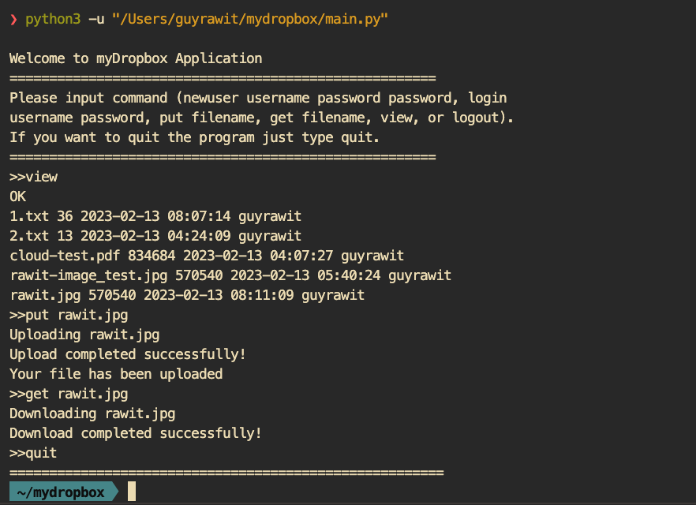

# Mydropbox app..
This is a python application that provide the function you can upload, download file with S3 Amazon cloud strorage.



## Application
### main.py

```
from myDropboxFunctions import put, get, view, newuser, login, create_folder
from helloMydropbox import welcome

if __name__ == "__main__":
    print(welcome())
    while(True):
        ## assign function & argument variables
        userinput = input(">>").strip().split()
        function = userinput[0]
        argument = userinput[1:]
        
        ## prevent one argument know as string
        argument = list(argument)
        
        ## call newuser function from myDropboxFunctions
        ## newuser guyrawit@hotmail.com password 12345678
        if function == "newuser":
            if len(argument)>0:
                if argument[1] == "password":
                    newuser(argument[0], argument[2])
                    create_folder(argument[0])
                else:
                    "Commands not found"
            else:
                print("No argument")
                
        ## login usernmae guyrawit@hotmail.com 12345678
        elif function == "login":
            if len(argument)>0:
                username, password = login(argument[0], argument[1])
                ##check that user is exist in database 
                print("Login successful")
            else:
                print("No argument")
        
        ## put file to S3 cloud
        elif function == "put":
            if len(argument) > 0:
                print(argument)
                put(argument, username)
            else:
                print("No argument")
                
                
        elif function == "get":
            get(argument, username)
                
        elif function == "view":
            view(username)
            
        elif function == "quit":
            print("="*55)
            break
        else:
            print("Please use existing keyword")
                
```

## Features

### myDropboxFunctions.py

`newuser(usernmae, password)` : Create new user for mydropbox account. (developing)

`login(username, password)` : Login to your mydropbox account.(developing)

`view(username)` : List all of your uploaded files to mydropbox app.

`get(filename, username)` : Download file to your local computer.

`put(filename)` : Upload file to mydropbox app.

`quit()` : Stop using mydropbox application.
### <b>view function</b>

```
def view(username):
    view_url = "https://18ktp7k6oj.execute-api.us-west-2.amazonaws.com/default/view"
    response = requests.post(view_url, json={"username":username} ,headers={'Accept': 'application/json'})
    res = response.json()
    if res:
        for key, value in res.items():
            name = str(value['key'])
            size = str(value['size'])
            date = str(value['date'])
            object_owner = str(value['object-owner'])
            print("{} {} {} {}".format(name, size, date, object_owner))  
    else:
        print("There is nothing in your storage")
    return 0
```
View function receive 1 argument that is `username` and parsing to `requests.post` from request Python module with lambda api gateway http endpoint(`view_url` variable). Loop over response JSON format(Python dictionary) name `res` and print out using python fstring.

Example of view function : 
```
>>view
1.txt 36 2023-02-13 10:58:40 guyrawit@hotmail.com
rawit.jpg 570540 2023-02-13 10:44:34 guyrawit@hotmail.com
```

### <b>get function</b>
`get(filename, username)` : Download file to your local computer.

```
def get(filename, username):
    download_url = " https://x8f28qdsuf.execute-api.us-west-2.amazonaws.com/default/download"
    print("Downloading {}".format(file_name))
    response = requests.post(download_url, headers={"file-name":"{}".format(file_name), "username":username})
    content = base64.b64decode(response.content)
    result = open(file_name, 'wb')
    result.write(content)
    
    if response.ok:
        print("Download completed successfully!")
    else:
        print("Something went wrong!")
    return 0
```

Get function receive 2 arguments that are `filename` and `username`. And using `requests.post` Python library to request post Lambda function with api gateway(`download_url` variable). Then Lambda function call `get_object` from Amazon S3 with boto3 library from `username/file` path. And encode the object to binary string with `base64.b64encode` python library. After that decode the binary string with `base64.b64decode` and write to local computer.

### <b>put function</b>
`put(filename)` : Upload file to mydropbox app.
```
def put(argument, username):
    upload_url = "https://wxlob71yg1.execute-api.us-west-2.amazonaws.com/default/upload"
    for file_name in argument:
        print("Uploading {}".format(file_name))
        with open(file_name, "rb") as f:
            encode_file = base64.b64encode(f.read())
            encode_string = encode_file.decode('utf-8')
            json_file = {"content":encode_string, "username":username}
            response = requests.post(upload_url, json=json_file, headers={"file-name":"{}".format(file_name)})
            if response.ok:
                print("Upload completed successfully!")
                print(response.text)
            else:
                print("Something went wrong!")
    return 0 
```
Put function receive two arguments that is `filename`(argument in function) & `username`. First, start by loop over list of filename to iterate over each file. For each file was encode by using `base64.b64encode` Python library and encode to string format with `encode_file.decode('utf-8')`. And sent request to API gateway with `requests.post` with json format. After that Lambda function will encode binary string and upload to S3 bucket.

### myDropboxFunctions.py

```
from myDropboxFunctions import put, get, view, newuser, login, create_folder
from helloMydropbox import welcome

if __name__ == "__main__":
    print(welcome())
    while(True):
        ## assign function & argument variables
        userinput = input(">>").strip().split()
        function = userinput[0]
        argument = userinput[1:]
        
        ## prevent one argument know as string
        argument = list(argument)
        
        ## call newuser function from myDropboxFunctions
        ## newuser guyrawit@hotmail.com password 12345678
        if function == "newuser":
            if len(argument)>0:
                if argument[1] == "password":
                    newuser(argument[0], argument[2])
                    create_folder(argument[0])
                else:
                    "Commands not found"
            else:
                print("No argument")
                
        ## login usernmae guyrawit@hotmail.com 12345678
        elif function == "login":
            if len(argument)>0:
                username, password = login(argument[0], argument[1])
                ##check that user is exist in database 
                print("Login successful")
            else:
                print("No argument")
        
        ## put file to S3 cloud
        elif function == "put":
            if len(argument) > 0:
                print(argument)
                put(argument, username)
            else:
                print("No argument")
                
                
        elif function == "get":
            get(argument[0], username)
                
        elif function == "view":
            view(username)
            
        elif function == "quit":
            print("="*55)
            break
        else:
            print("Please use existing keyword")

```
## myDropboxFunctions.py

`newuser(usernmae, password)` : Create a new user for your Dropbox account. 
By receiving the username and password and passing them along with the post request to the lambda function. After calling DynamoDB to see if the username exists, the lambda function attempts to insert an object into a DynamoDB table called "myDropboxUser." 

`login(username, password)` : Log in to your MyDropbox account. 
By receiving the username and password and passing them along with the post request to the Lambda function. After that, the lambda function tried to get an item from DynamoDB. If Username (partition key) is already existing, then check that the input password and value of the partition key (myDropboxUser table password) are the same. If the partition key does not exist or the password is not the same, the response loginstatus = False is returned. 

`logout()` : Logout from the dropbox application. 

`put(filename)` : Upload one file to Dropbox's cloud storage. 
After determining whether or not the file name already exists, it is converted to a binary string and sent to the Lambda function via a JSON post request. To avoid duplication, the Lambda function converts a binary string to a file and uploads it to an S3 bucket with the key object being the username followed by the filename. 

`view(username)` : List all of your uploaded files to the Dropbox app (including shared files). Sending a post request to the lambda function via the API Gateway. Then a lambda function called S3 is used to list all of the objects while filtering the key with username as a prefix. Moreover, a lambda function queries dynamodb for all "file_id"(sort key) that were shared with users  using "shared_user" (partition key).

`get(filename, username, owner)` : Download the file to your local computer with the specified owner. If you do not enter the owner, it will be you. Then, if you are the file owner, download the file from the S3 bucket with your username as prefix. But if not, the lambda function will check whether this file was shared or not in dynamodb "myDropboxSharedFiles" table. Then, with the object key, try to download (convert to a binary string using the put function). 

`share(username, file_name, shareduser)` : Share a file with another user. This function sends "username," "filename," and "shareduser" through a post request to the Lambda function API gateway. The Lambda function checks the S3 bucket to see if the file exists. Then connect to the DynamoDB "myDropboxUser" table to check that the shared user is exisitng. If both of them are existing lambda functions, add the shared user and file key to the "myDropboxSharedFiles" table.

`quit()` : Stop using mydropbox application.